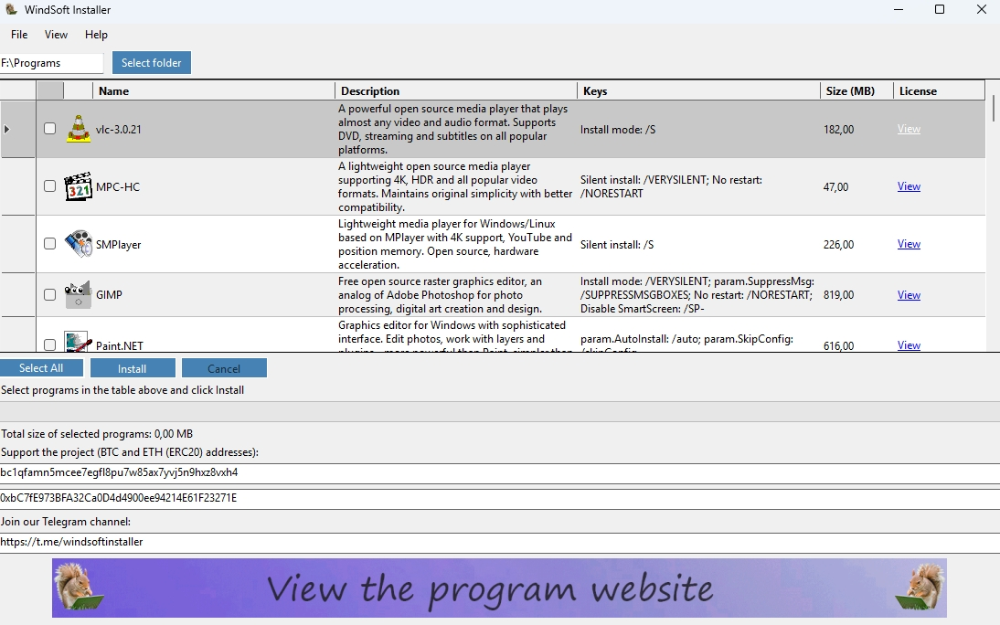
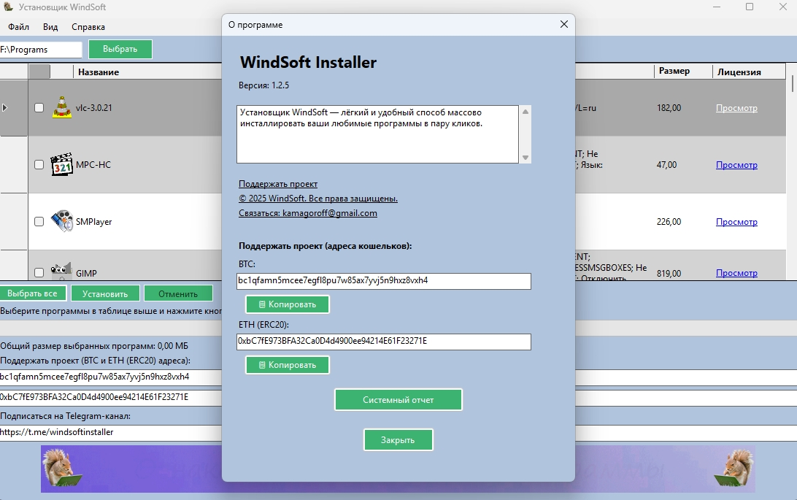
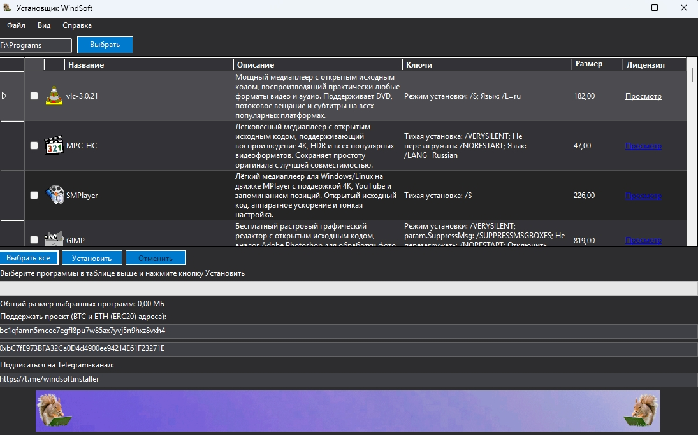

# WindSoftInstaller

**WindSoftInstaller** – это программа-установщик для Windows, позволяющая массово установить набор популярного свободного и условно-бесплатного ПО с минимальным участием пользователя. Программа автоматизирует распаковку, запуск инсталляторов (в том числе в тихом режиме), создаёт ярлыки на рабочем столе и сохраняет ваши предпочтения (язык, тему, путь установки).

> **Важно:** дистрибутивы приложений не входят в репозиторий. Файл `Installers.7z` необходимо скачать отдельно (см. раздел «Загрузка дистрибутивов») и поместить рядом с исполняемым файлом.

---

## Особенности

- 🚀 **Массовая установка** – выберите нужные программы в таблице и нажмите «Установить».
- 🔇 **Тихий режим** – большинство приложений устанавливаются без вмешательства пользователя.
- 🌍 **Двуязычный интерфейс** – русский и английский языки.
- 🎨 **Смена темы** – светлая, тёмная и стандартная темы оформления.
- 📦 **Портативные приложения** – поддерживаются ZIP/7z-архивы, которые распаковываются в выбранную папку.
- 🔗 **Автоматические зависимости** – при установке некоторых программ (например, Marble, MSI Afterburner) автоматически добавляются необходимые Visual C++ Redistributable.
- 🖥️ **Ярлыки** – создаются на рабочем столе для установленных приложений (если поддерживается). Некоторые установщики (например, XnView MP) создают ярлык самостоятельно.
- 🗑️ **Пошаговая очистка** – временные файлы удаляются сразу после установки каждого приложения, что предотвращает переполнение диска.
- 📋 **Системный отчёт** – в окне «О программе» можно скопировать информацию об ОС и .NET.
- ⚙️ **Редактирование параметров установки** – двойной клик по строке приложения открывает редактор ключей командной строки.

---

## Требования

- Windows 7 / 8 / 10 / 11 (x64)
- [.NET 8 Runtime](https://dotnet.microsoft.com/download/dotnet/8.0) (если используется автономный исполняемый файл, .NET уже включена)
- Права администратора (для записи в системные папки и реестр)

---

## Загрузка дистрибутивов

Вы можете получить программу двумя способами:

1. **Собрать из исходников** – следуя инструкции в разделе «Сборка из исходников» ниже.

2. **Скачать готовое решение** – полностью собранная версия программы (со всеми иконками, настройками и файлом `Installers.7z`) доступна для скачивания на официальном сайте:  
   👉 **[https://windsoftinstaller.site/](https://windsoftinstaller.site/)**  

   На сайте вы найдёте ссылки на архив, содержащий:
   - **Готовый к запуску `WindSoftInstaller.exe`** – не требуется установка .NET SDK или дополнительных библиотек.
   - **Полный набор иконок** в папке `Icons`.
   - **Архив `Installers.7z`** с дистрибутивами всех поддерживаемых приложений (размер > 5 ГБ).

   Просто скачайте архив, распакуйте в любую папку и запускайте `WindSoftInstaller.exe`.

---

Если вы решите использовать готовую сборку, вам не нужно будет ничего компилировать или настраивать – всё уже готово к работе.

---

### Ссылки для скачивания `Installers.7z`

Если вы предпочитаете скачать только архив с приложениями (например, для самостоятельной сборки), вот несколько надёжных файлообменников, поддерживающих файлы >5 ГБ:

- **pCloud** – [ссылка](https://e.pcloud.link/publink/show?code=XZmfCcZreP4b8HonDRr8XJYtq5FkkzNo8QX)
- **transfer** – [ссылка](https://transfer.it/t/UtS5km01QRYY) 

После скачивания поместите файл `Installers.7z` в ту же папку, где находится `WindSoftInstaller.exe`.

---

## Установка и использование

### 1. Подготовка
- Убедитесь, что файл `Installers.7z` лежит рядом с `WindSoftInstaller.exe`.
- (Опционально) добавьте свои иконки в папку `Icons` – они уже присутствуют в поставке, но вы можете заменить их на свои (формат `.ico`, имя должно совпадать с именем исполняемого файла в архиве).

### 2. Запуск
- Запустите `WindSoftInstaller.exe` с правами администратора (рекомендуется).
- Ознакомьтесь с лицензионным соглашением (EULA).
- Выберите язык интерфейса (русский или английский) – он будет использоваться для всех текстов и параметров установки.
- В главном окне укажите папку, куда будут установлены приложения (для некоторых программ, например, Google Chrome, путь игнорируется – они ставятся в системные каталоги).
- Отметьте галочками нужные программы в таблице.
- Нажмите кнопку **«Установить»**.

### 3. Процесс установки
- Программа извлечёт каждый выбранный пакет из `Installers.7z` во временную папку.
- Запустится процесс установки с переданными параметрами (тихий режим, путь установки, язык и т.д.).
- По окончании установки каждого приложения его временные файлы удаляются, а на рабочем столе создаётся ярлык (если поддерживается; иногда ярлык создаёт сам установщик).
- Процесс продолжается для следующего выбранного приложения.

### 4. Отмена
- Кнопка **«Отменить»** прерывает текущую установку (после завершения текущего пакета).

---

## Сборка из исходников

1. Установите [.NET 8 SDK](https://dotnet.microsoft.com/download/dotnet/8.0).
2. Клонируйте репозиторий:

        git clone https://github.com/yourusername/WindSoftInstaller.git
        cd WindSoftInstaller

3. Восстановите зависимости:

        dotnet restore

4. Соберите проект:

        dotnet build -c Release

5. Опубликуйте автономное приложение (рекомендуется):

        dotnet publish -c Release -r win-x64 --self-contained true -o ./publish

   Исполняемый файл и все необходимые библиотеки появятся в папке `publish`.

6. Запустите тесты (опционально):

        dotnet test WindSoftInstaller.Tests/WindSoftInstaller.Tests.csproj

---

## Поддерживаемые приложения

Ниже приведён полный список приложений, доступных для установки (все параметры и ключи тихой установки уже настроены):

| Название | Тип | Размер (МБ) |
|----------|-----|-------------|
| VLC media player | Обычный | 182 |
| MPC-HC | Обычный | 47 |
| SMPlayer | Обычный | 226 |
| GIMP | Обычный | 819 |
| Paint.NET | Обычный | 616 |
| Shotcut | Обычный | 489 |
| VSDC Free Video Editor | Обычный | 282 |
| Google Chrome | Обычный (системный) | 1230 |
| Mozilla Firefox | Обычный | 309 |
| Opera | Обычный | 451 |
| Audacity | Обычный | 88 |
| LMMS | Обычный | 101 |
| HandBrake | Обычный | 103 |
| XMedia Recode | Обычный | 94 |
| OpenShot | Обычный | 653 |
| AIMP | Обычный | 115 |
| Clementine | Обычный | 319 |
| 7-Zip | Обычный | 6 |
| qBittorrent | Обычный | 214 |
| HWiNFO64 | Обычный | 27 (расчётный) |
| PDF‑XChange Editor | Обычный (MSI) | 438 |
| ClamWin | Обычный | 34 |
| Emsisoft Emergency Kit | Портативный | 384 |
| Cryptomator | Обычный (MSI) | 124 |
| KeePass | Обычный | 9 |
| Bitwarden | Портативный | 244 |
| Wise Disk Cleaner | Обычный | 22 |
| BleachBit | Обычный | 43 |
| UltraDefrag | Обычный | 8 |
| RetroArch | Портативный | 524 |
| PCSX2 | Портативный | 96 |
| MSI Afterburner | Портативный | 41 |
| RivaTuner Statistics Server | Обычный | 97 |
| Anki | Обычный | 504 |
| Kiwix Desktop | Портативный | 267 |
| Calibre | Обычный (MSI) | 561 |
| Zotero | Обычный | 202 |
| PDFsam Basic | Обычный (MSI) | 101 |
| PDF24 Creator | Обычный (MSI) | 1010 |
| XnView MP | Обычный | 156 |
| FastStone Image Viewer | Обычный | 22 |
| VC++ 2013 Redistributable (x86/x64) | Системный | ~6+ |
| VC++ 2015-2022 Redistributable (x86/x64) | Системный | ~14+ |
| Marble | Обычный | 88 |
| Notepad++ | Обычный | 17 |
| Geany | Обычный | 121 |
| muCommander | Обычный (MSI) | 180 |
| Double Commander | Портативный | 44 |
| LibreOffice | Обычный (MSI) | 1300 |
| Apache OpenOffice Portable | Портативный | 1444 |

*Примечание: размеры указаны приблизительно и могут отличаться, в том числе  из-за обновлений программ.*

---

## Настройка параметров установки

Вы можете редактировать ключи командной строки для каждого приложения:
- Дважды кликните по строке приложения в таблице.
- Откроется окно со списком пар «ключ → значение».
- Изменяйте значения или добавляйте новые строки.
- Нажмите **OK** – новые параметры будут применены при следующей установке.

---

## Локализация

Язык интерфейса переключается через меню `Язык` / `Language`.
- Русский и английский варианты доступны для всех надписей, описаний приложений, EULA и параметров.
- При установке приложений автоматически передаются соответствующие языковые ключи (например, `/LANG=Russian` для InnoSetup или `/LANG=ru` для MSI).

---

## Темы оформления

Доступны три темы:
- **Стандартная** – светло-голубой фон, зелёные кнопки.
- **Тёмная** – тёмно-серые тона, подходит для работы в условиях низкой освещённости.
- **Светлая** – классический светлый интерфейс.

Выбранная тема сохраняется в пользовательских настройках.

---

## Структура проекта (кратко)

    WindSoftInstaller/
    ├── Services/
    │   ├── AppDataRules.cs          # Правила размеров и путей
    │   ├── InstallPlanRules.cs      # Правила плана установки (VC++, системные приложения)
    │   ├── InstallationManager.cs   # Основная логика установки
    │   └── ThemeManager.cs          # Управление темами
    ├── Utilities/
    │   ├── Localization.cs          # Строки локализации
    │   ├── MenuRenderer.cs          # Кастомная отрисовка меню
    │   ├── ProgressBarExtensions.cs # WinAPI для ProgressBar
    │   └── TempCleaner.cs           # Очистка временных папок
    ├── Properties/
    │   ├── AssemblyInfo.cs          # Сборка и InternalsVisibleTo для тестов
    │   ├── Resources.Designer.cs    # Ресурсы
    │   └── Settings.Designer.cs     # Настройки
    ├── WindSoftInstaller.Tests/     # Модульные тесты (xUnit)
    ├── AppRepository.cs             # Загрузка списка приложений из архива
    ├── InstallableApp.cs            # Модель приложения
    ├── InstallerArgumentsBuilder.cs # Построение аргументов командной строки
    ├── UiLogic.cs                   # Логика UI-параметров (скрытие, зависимости, размеры)
    ├── Form1.cs                     # Главная форма
    ├── AboutForm.cs                 # Окно «О программе»
    ├── EulaForm.cs                  # Окно лицензионного соглашения
    ├── ParamForm.cs                 # Редактор параметров установки
    ├── ShortcutHelper.cs            # Создание ярлыков
    ├── Program.cs                   # Точка входа
    ├── App.config                   # Конфигурация .NET
    ├── app.manifest                 # Манифест (запрос прав администратора)
    ├── WindSoftInstaller.csproj     # Файл проекта
    └── README.md                    # Этот файл

---

## Логирование

Приложение ведёт журнал в папке `Logs/installer.log` (формат Serilog, ежедневная ротация). Уровень логирования – `Debug`, что помогает при отладке и анализе ошибок.

---

## Лицензия

Исходный код распространяется под лицензией **MIT** (см. файл LICENSE).  
Стороннее ПО, устанавливаемое через WindSoftInstaller, распространяется под своими собственными лицензиями (GPL, MIT, проприетарные и т.д.). Использование приложений регулируется их EULA.

---

## Контакты и поддержка

- **Email:** kamagoroff@gmail.com  
- **Telegram-канал:** [@windsoftinstaller](https://t.me/windsoftinstaller)  
- **Сайт проекта:** [https://windsoftinstaller.site/](https://windsoftinstaller.site/)  

---

## Благодарности

- [Andreytsvl](https://github.com/Andreytsvl) – за разработку и поддержку сайта проекта.
- [SharpCompress](https://github.com/adamhathcock/sharpcompress) – библиотека для работы с архивами.
- [Serilog](https://serilog.net/) – библиотека для логирования.
- Microsoft .NET Team – за отличный фреймворк.

---

**WindSoftInstaller** – ваш надёжный помощник в быстрой настройке нового ПК.  
Приятного использования!